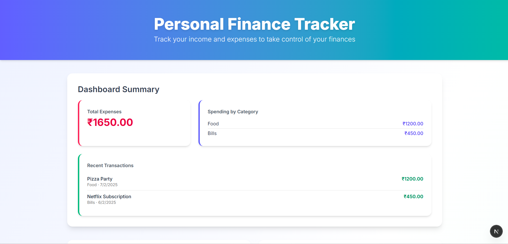
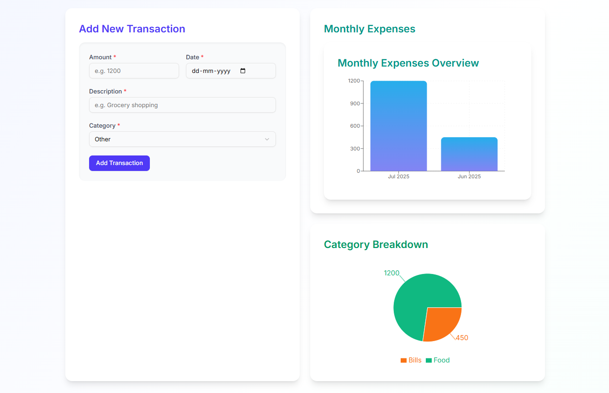
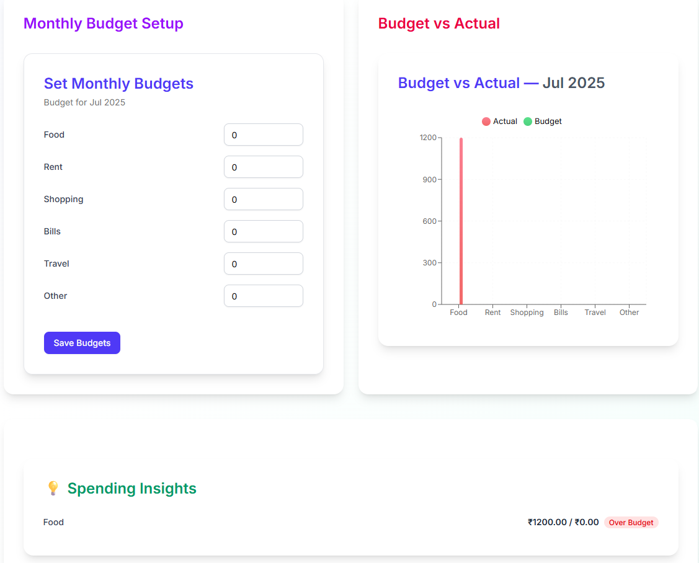

```md
# 💰 Walletly: Personal Finance Tracker

[](https://nextjs.org/)
[](https://tailwindcss.com/)
[](https://www.typescriptlang.org/)

**Walletly** A modern, visually polished and responsive **Personal Finance Tracker** built with Next.js App Router, TailwindCSS v4, TypeScript, MongoDB, Recharts, and shadcn/ui.  
Track your expenses, view charts, set monthly budgets, and get instant insights.

---

## 🌟 Features

- ✨ Add, view, and delete transactions
- 📊 Monthly bar chart of expenses
- 🥧 Category-wise pie chart
- 📋 Dashboard summary with totals and latest transactions
- 💸 Set monthly budgets for each category
- ⚖️ Compare Budget vs Actual in a visual chart
- 💡 Smart insights (Over/Under budget per category)
- 📅 Monthly selector support
- 💅 Beautiful UI built with **TailwindCSS + shadcn/ui**

---

## 📸 Screenshots

> *(Add your own screenshots here)*

| Dashboard Summary | Bar + Pie Charts | Budget + Insights |
|------------------|------------------|-------------------|
|  |  |  |

---

## 🧠 Tech Stack

| Technology    | Purpose                        |
|---------------|--------------------------------|
| **Next.js 15 App Router** | Routing & frontend framework |
| **TypeScript**   | Type safety across components |
| **Tailwind CSS v4** | Utility-first CSS styling |
| **shadcn/ui**     | UI components with accessibility |
| **Recharts**      | Bar & pie chart visualizations |
| **MongoDB**       | Data persistence for budgets & transactions |
| **Sonner**        | Toast notifications |

---

## 📁 Project Structure

```

.
├── components/
│   ├── TransactionForm.tsx
│   ├── TransactionList.tsx
│   ├── ExpensesChart.tsx
│   ├── CategoryPieChart.tsx
│   ├── DashboardSummary.tsx
│   ├── BudgetForm.tsx
│   ├── BudgetComparisonChart.tsx
│   ├── SpendingInsights.tsx
│
├── types/
│   └── index.ts
│
├── app/
│   ├── page.tsx ( HomePage)
|   ├── globals.css (Global Styles)
|
│
├── public/
│   └── screens/ (Add screenshots here)
│
└── README.md

````

---

## 🔧 Getting Started

### 1️⃣ Clone the Repo

```bash
git clone https://github.com/rohits2404/Personal-Finance.git
cd personal-finance
````

### 2️⃣ Install Dependencies

```bash
npm install
```

### 3️⃣ Setup Environment Variables

Create a `.env.local` file:

```env
MONGODB_URI=
```

### 4️⃣ Run the Dev Server

```bash
npm run dev
```

Visit [http://localhost:3000](http://localhost:3000) to view the app.

---

## 🔐 Type Definitions

```ts
// types/index.ts

export interface Transaction {
  _id: string;
  amount: number;
  description: string;
  date: string;
  category: string;
}

export interface Budget {
  _id?: string;
  month: string;
  category: string;
  amount: number;
}
```

---

## 📈 Roadmap

* [x] Add responsive dashboard layout
* [x] Budget vs Actual comparison
* [x] Smart insights section
